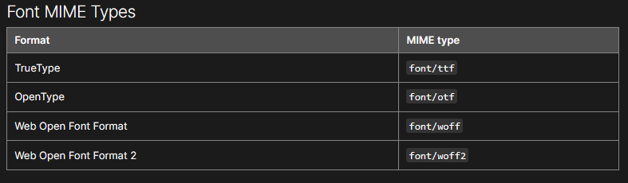

# web资源的仓库


## 说在前面

> 注意引用字体格式




##  阿里东方大楷

### 官网

[阿里妈妈东方大楷](https://www.iconfont.cn/fonts/detail?spm=a313x.7781069.1998910419.d9df05512&cnid=IhcTcFymWeyf)


### 引入

```css

@font-face {
  font-family: 'alimama';
  src: url('https://cdn.jsdelivr.net/gh/wuxin0011/web-cdn-resource@main/alimama/Alimama_DongFangDaKai_Regular.ttf') format('truetype');
}

```

或者

```html
<link blocking="render" href=https://cdn.staticaly.com/gh/wuxin0011/web-cdn-resource@main/alimama/Alimama_DongFangDaKai_Regular.ttf"  as="font" />
```


### 使用

```css
body {
    font-family: 'alimama';
}
```

**注意：如果引入样式失效，请尝试访问链接或者更换[CDN](#参考链接)** 


## MaterialDesign

### 官网

[icon](https://pictogrammers.com/library/mdi/)


### 引入

引入css


```html
 <link href="https://cdn.staticaly.com/gh/wuxin0011/web-cdn-resource@main/MaterialDesign-Webfont/7.2.96/css/materialdesignicons.css" rel="stylesheet">

```


### 字体

- [materialdesignicons-webfont.woff2](./MaterialDesign-Webfont/7.2.96/fonts/materialdesignicons-webfont.woff2)
- [materialdesignicons-webfont.woff](./MaterialDesign-Webfont/7.2.96/fonts/materialdesignicons-webfont.woff)
- [materialdesignicons-webfont.ttf](./MaterialDesign-Webfont/7.2.96/fonts/materialdesignicons-webfont.ttf)
- [materialdesignicons-webfont.otf](./MaterialDesign-Webfont/7.2.96/fonts/materialdesignicons-webfont.otf)


## 参考链接

###  说明参考

- [vuetify](https://vuetifyjs.com/en/features/icon-fonts/)
- [link](https://developer.mozilla.org/en-US/docs/Web/HTML/Element/link#attributes)
- [font-face](https://developer.mozilla.org/en/docs/Web/CSS/@font-face)

### CDN 参考

- [jsdelivr](https://www.jsdelivr.com/)
- [statically](https://statically.io/)
- [bootCDN](https://www.bootcdn.cn/MaterialDesign-Webfont/)
